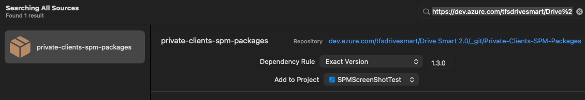
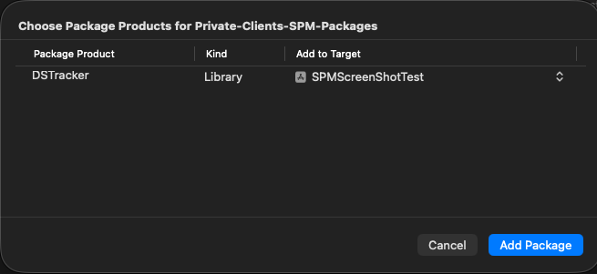
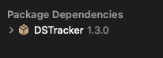

[](https://github.com/DriveSmart-MobileTeam/)
[](https://swift.org)

# DriveSmart *Tracker* Swift example

This project acts as an example of how to integrate DriveSmart (*DS* from now on) *Tracker* into an iOS app written in Swift.

The example application uses SwiftUI and therefore requires iOS 13 or later. The *Tracker* SDK itself supports iOS 12.1 or later.

## Requisites

* Swift Package Manager as the dependency manager.
* iOS 12.1 or later to integrate the SDK. This example application requires iOS 13 or later.
* Access to the private *DS* Swift Package repository.
* An Azure DevOps Personal Access Token provided by *DS*.
* A __license key__ provided by *DS* in order to make your app work with our *Tracker*.
* Your app needs to be configured to request user location and motion permissions. See [Apple documentation](https://developer.apple.com/documentation/corelocation/adding_location_services_to_your_app).

If your project does not meet any of these requirements, please contact us at [mobileteam@drive-smart.com](mailto:mobileteam@drive-smart.com) so we can look for alternatives for using our *Tracker*.

## 1) Installation

### 1.1) Configure access to the private repository

The package repository and the binary artifact are private. Add the credentials provided by *DS* to your `~/.netrc` file:

```text
machine dev.azure.com
login YOUR_AZURE_USERNAME
password YOUR_PERSONAL_ACCESS_TOKEN
```

Protect the file by executing:

```bash
chmod 600 ~/.netrc
```

> Never include the Personal Access Token in your source code, `Package.swift`, project URL or Git repository.

### 1.2) Add the *DS* Swift Package

In Xcode, select **File > Add Package Dependencies...** and enter the repository URL provided by *DS*:

```text
https://dev.azure.com/tfsdrivesmart/Drive%20Smart%202.0/_git/Private-Clients-SPM-Packages
```

Select **Exact Version**, enter `1.3.0`, and choose the project where the dependency must be added.



### 1.3) Add *DSTracker* to your application target

Select the `DSTracker` library and add it to your application target.



When the operation finishes, `DSTracker 1.3.0` will appear under **Package Dependencies**.



### 1.4) Import *DSTracker*

You can now import the SDK from any Swift file that needs to use it:

```swift
import DSTracker
```

There is no `pod install` step and the project does not need to be opened from a CocoaPods `.xcworkspace` file.

## 2) Configure the *Tracker*

In order to configure the *Tracker* to work with your *DS* account credentials, you need to provide the __license key__.

As the main purpose of the *Tracker* is to track user device location, your app needs to be granted `Location Always` permission for it to work in foreground and background.

> If your app intends to use the *Tracker* intensively, we encourage you to configure it from your `UIApplicationDelegate` or equivalent application startup flow.

### 2.1) Default configuration

In this configuration, the *Tracker* relies on your app to handle permission requests. It reports errors through `TrackerListenerInterface`, so we encourage you to implement it to keep track of those errors.

```swift
import DSTracker

func anySwiftFunction() {
    Tracker.configure(licenseKey: "__license key__") { result in
        if let error = result.failure {
            print(error.localizedDescription)
        } else if let successData = result.success {
            print("\(#function) DSTracker.configure result: \(successData)")
        }
    }
}
```

> In this demo project you can add the license key to the `Debug-Config.xcconfig` and `Release-Config.xcconfig` files. You can find more information about `*.xcconfig` files in [this article](https://nshipster.com/xcconfig/).

### 2.2) Configure the *Tracker* to request permissions

You can configure the *Tracker* to request permissions when needed:

```swift
import DSTracker

func anySwiftFunction() {
    Tracker.configure(
        licenseKey: "__license key__",
        doRequestPermissions: true
    ) { result in
        if let error = result.failure {
            print(error.localizedDescription)
        } else if let successData = result.success {
            print("\(#function) DSTracker.configure result: \(successData)")
        }
    }
}
```

The host application must include the corresponding location and motion usage descriptions in `Info.plist` and enable **Background Modes > Location updates**.

## 3) Setup the *Tracker* with your users

> You can check the implementation of these examples in `TrackerExampleService.swift`.

To use the *Tracker* to record trips associated with your users, you need to identify them within the *Tracker*. You have three options.

### 3.a) Register your user into the *Tracker*

```swift
import DSTracker

func anySwiftFunction() {
    let uniqueID = "an identifier under your control, typically your user's ID"

    Tracker.getOrAddUserIdBy(clientId: uniqueID) { result in
        if let error = result.failure {
            print("\(#file) - \(#function) addUniqueUserId error=\(error.localizedDescription)")
        }

        guard let trackerUserID = result.success as? String else {
            print("The response does not contain a DSTracker user ID. Please contact DS.")
            return
        }

        // On success, DSTracker is configured with this user ID and is ready
        // to start recording trips for that user.
        print(trackerUserID)
    }
}
```

> We recommend storing the `trackerUserID` returned here so it can be reused in future application runs using the method below.

### 3.b) Setup with a known *Tracker* user identifier

If you already know the *Tracker* user ID, or stored the one provided in step *3.a*, you can use it for a quicker setup:

```swift
import DSTracker

func anySwiftFunction() {
    Tracker.setUserId("a known DSTracker user identifier") { result in
        if let error = result.failure {
            print("\(#file) - \(#function) setUserId error=\(error.localizedDescription)")
        }

        guard let trackerUserID = result.success as? String else {
            print("The response does not contain a DSTracker user ID. Please contact DS.")
            return
        }

        print(trackerUserID)
    }
}
```

### 3.c) Get a *Tracker* user identifier to associate with your user

If you do not want to send your own user identifier to our systems, request an anonymous *Tracker* user identifier and store the relationship in your own system:

```swift
import DSTracker

func anySwiftFunction() {
    Tracker.getAnonymousUserId { result in
        if let error = result.failure {
            print("\(#file) - \(#function) anonymous user error=\(error.localizedDescription)")
        }

        guard let trackerUserID = result.success as? String else {
            print("The response does not contain a DSTracker user ID. Please contact DS.")
            return
        }

        print(trackerUserID)
    }
}
```

## 4) Trip recording

> You can check this section in `TrackerExampleService.swift` and its presentation in `ContentView.swift`.

At this point everything is configured and ready to start recording trips.

### 4.1) Start

This method starts capturing the device location until you call the stop method:

```swift
func startTrip() {
    Tracker.start()
}
```

### 4.2) Get information about the trip in progress

At any time while the *Tracker* is recording a trip, you can check its current status:

```swift
func getTrackingStatusInfo() {
    let trackingStatus = Tracker.getStatus()

    switch trackingStatus.levelGPS {
    case .bad:
        print("BAD")
    case .good:
        print("GOOD")
    case .regular:
        print("REGULAR")
    @unknown default:
        break
    }

    print(trackingStatus.timer)
    print(trackingStatus.totalDistance)
    print(trackingStatus.serviceTime)
}
```

### 4.3) Stop

This stops capturing device location and tries to send all pending tracking data to our servers:

```swift
func stopTrip() {
    Tracker.stop()
}
```

## 5) Request background location permission

For trip recording to continue while the application is in the background, request `Always` authorization after the user grants `When In Use` authorization:

```swift
func locationManager(
    _ manager: CLLocationManager,
    didChangeAuthorization status: CLAuthorizationStatus
) {
    if status == .authorizedWhenInUse {
        manager.requestAlwaysAuthorization()
    }
}
```

The exact system prompts are controlled by iOS. The corresponding usage descriptions must be present in `Info.plist`.

## 6) [Optional] Get informed about *Tracker* events and errors

The *Tracker* uses delegation to report important internal events that may be useful for your integration.

First, provide an implementation of `TrackerListenerInterface` as the delegate:

```swift
Tracker.delegate = self
```

Then implement the protocol:

```swift
extension TrackerExampleService: TrackerListenerInterface {
    func onEvent(_ event: TrackerEvent) {
        switch event {
        case .dataAllSent:
            print("All pending tracking data has been sent to our servers")
        case .dataSendFailed:
            print("A tracking data batch could not be sent")
        case .dataSendPaused:
            print("Tracking data communication has been paused")
        case .dataSendStarted:
            print("Tracking data communication has started")
        case .dataSendSuccess:
            print("Tracking data communication succeeded")
        case .trackingAlreadyStarted:
            print("Tracking was already running")
        case .trackingAlreadyStopped:
            print("Tracking was already stopped")
        case .trackingStarted:
            print("Tracker started tracking location")
        case .trackingStopped:
            print("Tracker stopped tracking location")
        @unknown default:
            break
        }
    }

    func onError(_ error: TrackerError) {
        print(error.localizedDescription)
    }
}
```
